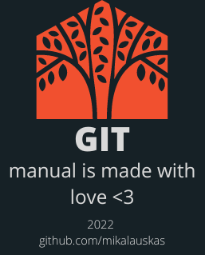

<!-- STATIC HEADER -->
[](README.md)

<!-- STATIC HEADER -->
# Инструкция по работе с GIT
*Инструкция написана в кратком варианте. Не все функции включены*

* [Введение](#инструкция-по-работе-с-git)
* [Установка git](docs/install.md)
* [Краткая шпаргалка](#краткая-шпаргалка)
    * [Первоначальная настройка](#первоначальная-настройка)
    * [Создание репозитория](#создание-репозитория)
    * [Операции с файлами](#операции-с-файлами)
    * [Внесение изменений](#внесение-изменений)
    * [Коллективная работа](#коллективная-работа)
    * [Игнорирование некоторых файлов](#игнорирование-некоторых-файлов)
    * [Просмотр истории](#просмотр-истории)
    * [Откат коммитов](#откат-коммитов)
    * [Синхронизация с удалённым репозиторием](#синхронизация-с-удалённым-репозиторием)
* Команды
    * [git init](docs/init.md)
    * [git clone](docs/clone.md)
    * [git add](docs/add.md)
    * [git commit](docs/commit.md)
    * [git pull](docs/pull.md)
    * [git push](docs/push.md)
    * [git merge](docs/merge.md)
    * [git remote](docs/remote.md)
    * [git status](docs/status.md)
    * [git diff](docs/diff.md)
* [Полная документация (git-scm.com)](https://git-scm.com/docs)

$~$
# Краткая шпаргалка
## Первоначальная настройка
### Настройка информации о пользователе для всех локальных репозиториев

$~$

Устанавливает имя, которое будет отображаться в поле автора у выполняемых вами коммитов:

    $ git config --global user.name "[имя]"

Устанавливает адрес электронной почты, который будет отображаться в информации о выполняемых вами коммитах:

    $ git config --global user.email "[адрес электронной почты]"

*[Назад к Содержанию](#инструкция-по-работе-с-git)*

---
$~$
## Создание репозитория
### Создание нового репозитория или получение его по существующему URL-адресу

$~$

Создаёт новый локальный репозиторий с заданным именем:

    $ git init [название проекта]

Скачивает репозиторий вместе со всей его историей изменений:

    $ git clone [url-адрес]

*[Назад к Содержанию](#инструкция-по-работе-с-git)*

---
$~$
## Операции с файлами
### Перемещение и удаление версий файлов репозитория

$~$

Удаляет конкретный файл из рабочей директории и индексирует его удаление:

    $ git rm [файл]

Убирает конкретный файл из контроля версий, но физически оставляет его на своём месте:

    $ git rm --cached [файл]

Перемещает и переименовывает указанный файл, сразу индексируя его для последующего коммита:

    $ git mv [оригинальный файл] [новое имя]

*[Назад к Содержанию](#инструкция-по-работе-с-git)*

---
$~$
## Внесение изменений
### Просмотр изменений и создание коммитов (фиксация изменений)

$~$

Перечисляет все новые или изменённые файлы, которые нуждаются в фиксации:

    $ git status

Показывает различия по внесённым изменениям в ещё не проиндексированных файлах:

    $ git diff

Индексирует указанный файл для последующего коммита:

    $ git add [файл]

Показывает различия между проиндексированной и последней зафиксированной версиями файлов:

    $ git diff --staged

Отменяет индексацию указанного файла, при этом сохраняет его содержимое:

    $ git reset [файл]

Фиксирует проиндексированные изменения и сохраняет их в историю версий:

    $ git commit -m "[сообщение с описанием]"

*[Назад к Содержанию](#инструкция-по-работе-с-git)*

---
$~$
## Коллективная работа
### Именованные серии коммитов и соединение результатов работы

$~$

Список именованных веток коммитов с указанием выбранной ветки:

    $ git branch

Создаёт новую ветку:

    $ git branch [имя ветки]

Переключается на выбранную ветку и обновляет рабочую директорию до её состояния:

    $ git switch -c [имя ветки]

Вносит изменения указанной ветки в текущую ветку:

    $ git merge [имя ветки]

Удаляет выбранную ветку:

    $ git branch -d [имя ветки]

*[Назад к Содержанию](#инструкция-по-работе-с-git)*

---
$~$
## Игнорирование некоторых файлов
### Исключение временных и вторичных файлов и директорий

$~$

Git будет игнорировать файлы и директории, перечисленные в файле `.gitignore` с помощью wildcard синтаксиса:

```
*.log
build/
temp-*
```

Список всех игнорируемых файлов в текущем проекте:

    $ git ls-files --others --ignored --exclude-standard

*[Назад к Содержанию](#инструкция-по-работе-с-git)*

---
$~$
## Просмотр истории
### Просмотр и изучение истории изменений файлов проекта

$~$

История коммитов для текущей ветки:

    $ git log

История изменений конкретного файла, включая его переименование:

    $ git log --follow [файл]

Показывает разницу между содержанием коммитов двух веток:

    $ git diff [первая ветка]...[вторая ветка]

Выводит информацию и показывает изменения в выбранном коммите:

    $ git show [коммит]

*[Назад к Содержанию](#инструкция-по-работе-с-git)*

---
$~$
## Откат коммитов
### Удаление ошибок и корректировка созданной истории

$~$

Отменяет все коммиты после заданного, оставляя все изменения в рабочей директории:

    $ git reset [коммит]

Сбрасывает всю историю вместе с состоянием рабочей директории до указанного коммита:

    $ git reset --hard [коммит]

*[Назад к Содержанию](#инструкция-по-работе-с-git)*

---
$~$
## Синхронизация с удалённым репозиторием
### Регистрация удалённого репозитория и обмен изменениями

$~$

Скачивает всю историю из удалённого репозитория:

    $ git fetch [удалённый репозиторий]

Вносит изменения из ветки удалённого репозитория в текущую ветку локального репозитория:

    $ git merge [удалённый репозиторий]/[ветка]

Загружает все изменения локальной ветки в удалённый репозиторий:

    $ git push [удалённый репозиторий] [ветка]

Загружает историю из удалённого репозитория и объединяет её с локальной. pull = fetch + merge:

    $ git pull

*[Назад к Содержанию](#инструкция-по-работе-с-git)*