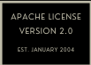

<!-- STATIC HEADER -->
[](../README.md)

[](../LICENSE)

<!-- STATIC HEADER -->
# git init
## Создание пустого репозитория или реинициализация существующего
$~$
### Краткое описание:
Этой командой создается пустой репозиторий в текущей директории. По сути это команда создает .git директорию с настройками репозитория. An initial branch without any commits will be created (see the --initial-branch option below for its name).

Запуск команды в существующем репозитории безопасно и не влечет за собой удаление или изменение существующего репозитория. Основная функция запуска команды в существующем репозитории это подгрузка новых шаблонов. Если указан аргумент --separate-git-dir, то репозиторий будет перемещен в указанную аргументом директорию.
$~$
# Основные опции

If you provide a directory, the command is run inside it. If this directory does not exist, it will be created.
### **-q**

### **--quiet**

    Выводит только ошибки или предупреждения. Все остальные сообщения будут скрыты.

### **--bare**

    Create a bare repository. If GIT_DIR environment is not set, it is set to the current working directory.

### **--object-format=\<format>**

    Specify the given object format (hash algorithm) for the repository. The valid values are sha1 and (if enabled) sha256. sha1 is the default.
        
        THIS OPTION IS EXPERIMENTAL! SHA-256 support is experimental and still in an early stage. A SHA-256 repository will in general not be able to share work with "regular" SHA-1 repositories. It should be assumed that, e.g., Git internal file formats in relation to SHA-256 repositories may change in backwards-incompatible ways. Only use --object-format=sha256 for testing purposes.


### **--template=\<template-directory>**

    Specify the directory from which templates will be used. (See the "TEMPLATE DIRECTORY" section below.)

### **--separate-git-dir=\<git-dir>**

    Instead of initializing the repository as a directory to either $GIT_DIR or ./.git/, create a text file there containing the path to the actual repository. This file acts as filesystem-agnostic Git symbolic link to the repository.

    If this is reinitialization, the repository will be moved to the specified path.

### **-b \<branch-name>**
### **--initial-branch=\<branch-name>**
    Use the specified name for the initial branch in the newly created repository. If not specified, fall back to the default name (currently master, but this is subject to change in the future; the name can be customized via the init.defaultBranch configuration variable).

**--shared[=(false|true|umask|group|all|world|everybody|<perm>)]**

    Specify that the Git repository is to be shared amongst several users. This allows users belonging to the same group to push into that repository. When specified, the config variable "core.sharedRepository" is set so that files and directories under $GIT_DIR are created with the requested permissions. When not specified, Git will use permissions reported by umask(2).

    The option can have the following values, defaulting to group if no value is given:

    ***umask (or false)***

    Use permissions reported by umask(2). The default, when --shared is not specified.

    ***group (or true)***
    Make the repository group-writable, (and g+sx, since the git group may be not the primary group of all users). This is used to loosen the permissions of an otherwise safe umask(2) value. Note that the umask still applies to the other permission bits (e.g. if umask is 0022, using group will not remove read privileges from other (non-group) users). See 0xxx for how to exactly specify the repository permissions.

    ***all (or world or everybody)***
    Same as group, but make the repository readable by all users.

    **\<perm>**

    **\<perm>** is a 3-digit octal number prefixed with 0 and each file will have mode **\<perm>**. **\<perm>** will override users' umask(2) value (and not only loosen permissions as group and all does). 0640 will create a repository which is group-readable, but not group-writable or accessible to others. 0660 will create a repo that is readable and writable to the current user and group, but inaccessible to others (directories and executable files get their x bit from the r bit for corresponding classes of users).
$~$
# Примеры
**Start a new Git repository for an existing code base**
```
$ cd /path/to/my/codebase
$ git init      (1)
$ git add .     (2)
$ git commit    (3)

```
1. Create a /path/to/my/codebase/.git directory.
2. Add all existing files to the index.
3. Record the pristine state as the first commit in the history.