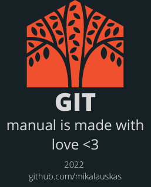

<!-- STATIC HEADER -->
[](../README.md)

<!-- STATIC HEADER -->
# Git Merge
*[Назад к Содержанию](../README.md#инструкция-по-работе-с-git)*

```sh
git merge
```

`git merge` это когда мы отправляем всё, что сделали в одной ветке, в другую. Весь новый код, исправления ошибок, дополнительные функции — всё это отправится в новую ветку. Если же мы что-то удалим в коде, то при объединении этот фрагмент тоже удалится из основной ветки.

## Что делает `git merge`?

Слияние (`git merge`) — обычная практика для разработчиков, использующих системы контроля версий. Независимо от того, созданы ли ветки для тестирования, исправления ошибок или по другим причинам, слияние фиксирует изменения в другом месте. Слияние принимает содержимое ветки источника и объединяет их с целевой веткой. В этом процессе изменяется только целевая ветка. История исходных веток остается неизменной.

## Как использовать `git merge`

Слейте ветку master в ветку feature, используя команды checkout и merge.

```
$ git checkout feature
$ git merge master
(или)
$ git merge master feature
```

Это создаст новый «Merge commit» в ветке feature, который содержит историю обеих веток.

Подробнее о `git merge` в [git-scm's документации](https://git-scm.com/docs/git-merge).

*[Назад к Содержанию](../README.md#инструкция-по-работе-с-git)*